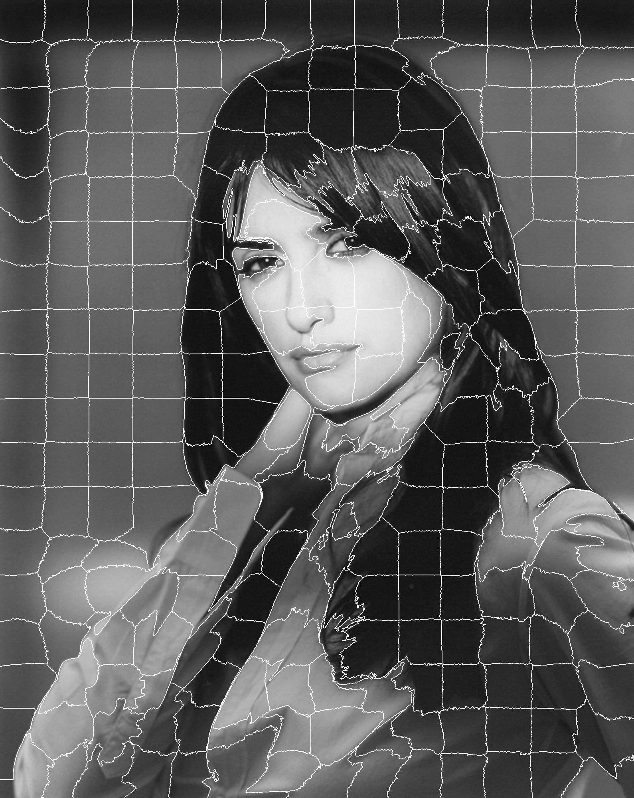

# BITCS_DIP_Project3 SLIC 
Superpixels Compared to State-of-the-Art Superpixel Methods

R. Achanta, A. Shaji, K. Smith, A. Lucchi, P. Fua and S. Süsstrunk, "SLIC Superpixels Compared to State-of-the-Art Superpixel Methods," in IEEE Transactions on Pattern Analysis and Machine Intelligence, vol. 34, no. 11, pp. 2274-2282, Nov. 2012, doi: 10.1109/TPAMI.2012.120.

SLIC 作为一种生成超像素的算法，其性能与表现超越了当时现有的所有同类算法，达到了SOTA 水平，得益于其较快的速度和更高的内存效率，为各种图像处理领域的下游任务带来了极大的便利。本项目使用 C++ 成功复现了 SLIC 算法，体会到了该算法的精妙所在。

# 效果展示
 

